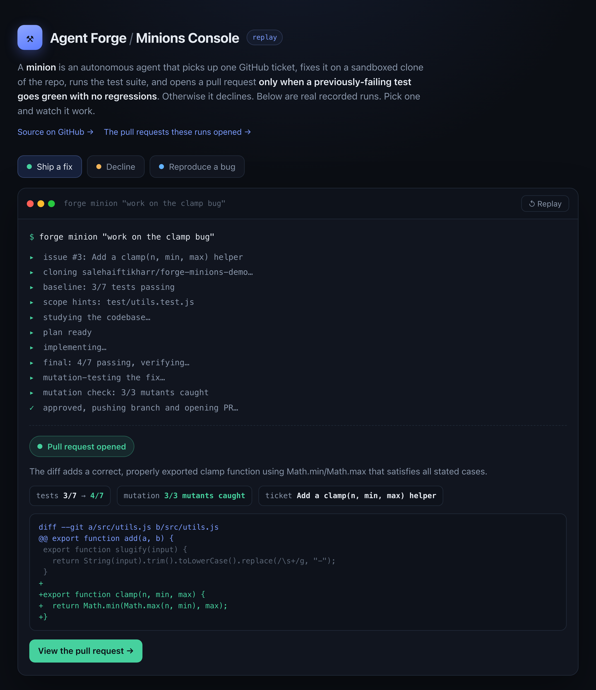

# Agent Forge

[](https://github.com/salehaiftikharr/agent-forge/actions/workflows/ci.yml)
[](LICENSE)

Agents that do real work, and prove it. **Forge** builds agents from plain
English. Its **minions** fix real GitHub and Linear tickets and open a pull
request only when the tests prove the fix, and decline when they cannot.

**[▶ Watch it run](web/index.html)** in the minions console: a replay of real
recorded runs, including the one where it declines rather than ship a bad fix.

[](web/index.html)

The single number that matters: on a hand-labeled eval, the minions had **zero
unsafe ships**. They shipped every legitimate fix and refused every bad one. And
the proof is not a screenshot: a minion read an issue on a public demo repo and
opened this on its own,
**[forge-minions-demo#2](https://github.com/salehaiftikharr/forge-minions-demo/pull/2)**.

## In 30 seconds

- **Verification gate.** A minion opens a pull request only when a
  previously-failing test passes with no regressions, and it cannot edit the
  test it is judged against.
- **Zero unsafe ships** on a hand-labeled evaluation: 4/4 good fixes shipped,
  3/3 bad fixes declined.
- **One engine, three doors.** The same engine drives a CLI, a Slack bot, and a
  web product.
- **Auditable by design.** Every run carries a receipt: steps, tool calls,
  approvals, refusals, tests, and cost.

## The web product

A full product surface lives in [`web/`](web/): a landing page, a guided demo
that walks a Minion from proposal to a verified pull request, and an application
(Forge workbench, Minions roster and detail, Runs with timelines and
approvals).

```
cd web && npm install && npm run dev   # http://localhost:3001
```

Public pages use a fictional dataset; the evaluation numbers are read from the
engine's recorded output. See [`web/README.md`](web/README.md) and the rebuild
notes in [`docs/REBUILD-AUDIT.md`](docs/REBUILD-AUDIT.md).

## What it is

- **Forge** takes a plain-English description and designs a working agent for it
  (system prompt, a fixed set of safe tools, and its own acceptance tests), then
  tests it and, if it fails, repairs it and tests again until it passes. What you
  get back is a runnable agent plus a receipt proving what it does.
- **Minions** are what Forge makes: autonomous workers that each pick up one
  ticket, fix it on a sandboxed clone of the repo, run the test suite, and open a
  pull request only when a previously-failing test goes green with no regressions.
  Otherwise they decline. A minion can read the tests but physically cannot write
  them, so it cannot pass by editing the gate it is judged against.

Run it from the CLI, or chat with a Slack bot ("show me the issues in ENG" then
"work on the login bug"). Everything is verified, receipted, and auditable.

## Forge: an agent that builds agents

You describe an automation; Forge designs the agent, generates its acceptance
tests, and runs the agent against them. When it falls short, it feeds the
failures back to the builder, which revises the agent and re-tests. An agent
improving an agent, with evals as the control signal.

```
$ forge build "Given a city, tell me its current weather using the open-meteo API" --repair
✓ Built "weather-reporter"  (tools: http_get_json, current_datetime, calculator · tests: 4)

Receipt "weather-reporter": passing (4/4) via anthropic/claude-opus-4-8
  build      4/4
```

Claude (`claude-opus-4-8`) often clears the bar on the first build. The loop
earns its keep when a build does not, and because the provider is a one-line
seam you can watch it work on either model. The same task built on GPT-4.1
missed one test (it fetched the weather but did not cite the source the test
demanded) and the repair round fixed exactly that:

```
Receipt "city-weather-fetcher": passing (3/3) via openai/gpt-4.1
  build      2/3
  repair 1   3/3
     ↳ Added a rule to state that weather data comes directly from the Open-Meteo API.
```

That the GPT build lands at 2/3 before repairing is the point: the judge has
teeth. Both receipts are committed in [`examples/`](examples/).

## Minions: verified ticket-closers

A minion fixes one ticket on a sandbox copy of the repo, runs the tests, and
ships a branch, diff, and receipt only if the fix turns a failing test green
without breaking anything. If it cannot, it declines.

```
$ forge minion all

▶ [TICKET-001] slugify collapses consecutive spaces into one dash
✓ shipped   (3/6 tests) · branch minion/ticket-001
▶ [TICKET-002] Add a clamp(n, min, max) helper
✓ shipped   (3/6 tests) · branch minion/ticket-002
▶ [TICKET-004] User reports add(2, 2) should equal 5
⊘ declined  (won't break the passing add() test to satisfy a bogus report)

  fleet done: 2 shipped, 1 declined
```

What makes this different from "an agent that opens PRs" is that the
verification is real and the agent cannot game it:

- **The gate is the test suite, re-run by the harness, never the model's word.**
  A ticket ships only if a previously-failing test is now green and no passing
  test regressed, tracked per-test by name.
- **A minion can read tests but cannot write them.** The workspace physically
  refuses writes to the test directory.
- **It declines bad work.** The "add(2,2) should be 5" report is bogus;
  satisfying it would regress a passing test, so the minion declines. Knowing
  when not to proceed is the feature.
- **Every run leaves a receipt**: baseline vs. final tests, steps, the diff, and
  the ship or decline decision with its reason.

It writes only inside a per-ticket sandbox (`.minion-runs/`), only to source, and
produces a branch for human review. It never touches `main` and never auto-merges.

### The verification eval: zero unsafe ships

An autonomous PR-opener is only as trustworthy as its decision about when to open
one. `forge eval` holds the gate to a hand-labeled set: four tickets that should
ship (real, testable fixes) and three that should be declined (shipping would
regress a passing test, or the change cannot be verified at all).

```
$ forge eval

Accuracy: 7/7 (100%)
Ship recall: 4/4 · Correctly declined: 3/3
Unsafe ships (shipped work that should have been declined): 0
```

Zero unsafe ships is the property that matters. An agent that ships bad work
autonomously is worse than no agent; this is how you show it does not.
`forge corpus` keeps that honest over time by checking what humans actually did
with each shipped PR (merged, or closed unmerged) and turning any rejection into
a new labeled eval case.

### Real pull requests

`forge pr <owner/repo> <issue>` runs the same minion and the same gates on a real
cloned repository, and only when the gates pass pushes a branch and opens an
actual pull request. A minion read issue #1 on a demo repo and opened
[forge-minions-demo#2](https://github.com/salehaiftikharr/forge-minions-demo/pull/2)
on its own, a one-line verified fix with no regressions:

```diff
 export function slugify(input) {
-  return String(input).trim().toLowerCase().replace(/ /g, "-");
+  return String(input).trim().toLowerCase().replace(/\s+/g, "-");
 }
```

## How a minion works, and why it is hard to game

```
ticket → study the codebase (read-only) → write a plan
       → branch off the base → implement (edit SOURCE only, run tests, iterate)
       → harness re-runs the repo's OWN tests (ground truth)
       → gate: a failing test went green AND nothing regressed?
       → mutation check: mangle the fix's own lines, does the test catch it?
       → judge: is the diff a legitimate, minimal fix?
       → adversarial panel (optional): N skeptics try to refute it
       → score: confidence (0 to 1) + blast radius → ship ready, or open a DRAFT
       → SHIP (branch + PR) + receipt, or DECLINE + receipt
```

A green test proves the test is satisfied, not that the fix is real. Several
layers sit under that:

- **Mutation testing.** Perturb the fix's own lines (delete them, flip a
  comparison, bump a constant) and re-run. If the now-green test survives every
  mutation, it is not actually pinning the fix, so the minion declines as likely
  gamed.
- **Flaky-test guarding.** `MINION_TEST_RUNS` runs the suite N times and trusts a
  test only if it passes every run, so a flaky green never earns a ship.
- **Adversarial review, on demand.** Set `MINION_VERIFIERS=3` and a panel of
  independent skeptics weighs in, each told to refute the change through a
  different lens (a wrong edge case, a superficial pass, a regression the ticket
  never mentioned). The change ships only if it beats a majority; a tie errs
  toward rejection.
- **Confidence and blast-radius scoring.** Passing every gate says nothing about
  how risky shipping unattended is, so an approved change is also scored. A
  calibrated confidence (0 to 1, from the mutation catch rate, tests flipped, the
  judge's verdict, and how much the diff touches) and a mechanical blast-radius
  read decide the lane: high-confidence and low-risk opens ready to merge;
  anything else clears the same gates but opens as a draft for a human.
  `MINION_CONFIDENCE_MIN` (default `0.7`) is one number you tune from receipts.
- **Best-of-N.** Set `MINION_CANDIDATES` and the minion generates several
  independent fixes from the same plan, runs every one through the full gate, and
  keeps the strongest (highest confidence, then smallest blast radius, then
  smallest diff). The bar is unchanged; a hard ticket just gets more chances.
  Capped at 5, and it stops early once a candidate clears the auto-ship bar.
- **Reproduction mode.** `forge spec <owner/repo> <n>` dispatches a separate
  spec-author minion that writes only a failing reproduction test for an untested
  bug and opens it for review. A fixer (which can write source but never tests)
  is then pointed at the approved gate it never authored. One minion writes the
  gate, a different one fixes against it, and neither can do both.
- **Repo-agnostic and self-sharpening.** It auto-detects the test runner (Vitest,
  Jest, Mocha, Go, node:test), scopes from the ticket's stack trace, and keeps a
  per-repo profile of where past fixes landed, so it heads straight for the files
  that matter instead of reading the whole tree every run.

### Observability, trajectory evals, and memory

- **Tracing.** Every model call flows through one instrumented wrapper, so a run
  records per-step type, latency, tokens, and failures. `forge trace` prints the
  rollup; traces persist to `.forge-traces/`.
- **Trajectory evals.** `forge eval` grades the final decision; `forge
  eval:trajectory` grades the path: did it converge, did it recover from a failing
  first build, how many repair rounds, at what token and latency cost.
- **Persistent memory.** When a repair fixes a failing test, that lesson is
  appended to `.forge-memory/` and recalled on the next build, so the system
  carries forward what it learned instead of rediscovering it.

## Talk to your minions in Slack

The same minion has a front door: DM the bot in plain English and it will either
browse the work or do it. It runs in Socket Mode (no public URL, no deploy) on
the laptop where `gh` is already authenticated.

```
you:    show me the open issues in ENG
minion: Here's the open work in ENG (3):
        1. ENG-10  Fix login button not responding on Safari  (Todo)
        2. ENG-11  Add CSV export to the analytics dashboard   (Todo)
        3. ENG-12  Crash when uploading large avatar images    (In Progress)

you:    work on the login bug in salehaiftikharr/forge-minions-demo
minion: On it: ENG-10 → salehaiftikharr/forge-minions-demo.
        cloning… reproducing… fix verified (4/4 tests, no regressions)
        ENG-10 → https://github.com/…/pull/7   (and comments the link back on Linear)
```

It remembers the list it just showed you per thread, so you can follow up with
"do the second one" or "work on all of them" without repeating yourself. Choosing
which ticket to run is a pure, unit-tested function
([`src/linear/select.ts`](src/linear/select.ts)); when a request is ambiguous it
asks rather than guesses. `forge fleet` is the all-day mode: it watches the ticket
list and dispatches a minion whenever a ticket is new or its text changed, and a
ledger keyed by ticket-text hash means it never redoes work.

## Architecture

```
forge build "..."         forge refine <name>          forge run <name>
      │                          │                            │
      ▼                          ▼                            ▼
   builder.ts            refine.ts (the loop)             runtime.ts
 generateObject →     ┌─ test ─ fail? ─ repair.ts ─┐    generateText + the
 a validated          │  (judge)     (revise spec)  │   spec's granted tools,
 AgentSpec            └──── re-test ──── … ─────────┘   in a step-capped loop
```

- **`spec.ts`**: the `AgentSpec` zod schema and disk storage, re-validated on load.
- **`builder.ts`**: one `generateObject` call that designs the agent; unknown
  tools are stripped against the registry.
- **`refine.ts` / `repair.ts`**: the self-repair loop and the revision step,
  emitting a receipt of the whole run.
- **`runtime.ts`**: the agent loop (`generateText` + `stepCountIs`), returning the
  answer plus a trace of every tool call.
- **`judge.ts`**: runs an agent's tests and grades each with a separate verdict.
  Behavior is the ground truth, not string-matching.
- **`tools/registry.ts`**: the fixed, safe primitives (`web_fetch`,
  `http_get_json`, `calculator`, `current_datetime`). A built agent can only be
  granted tools Forge ships; no filesystem, no shell, no writes. That constraint
  is the v1 safety model, stated plainly.
- **`src/minion/`**: the sandbox boundary and role-based permissions
  (`workspace.ts`), runner detection (`test-runner.ts`), the mutation engine
  (`mutate.ts`), reproduction mode (`spec.ts`), scoping (`scope.ts`), the per-repo
  profile (`profile.ts`), the PR-outcome corpus (`corpus.ts`), blast-radius
  (`risk.ts`), confidence (`confidence.ts`), the adversarial panel (`verify.ts`),
  cost estimation (`pricing.ts`, `economics.ts`), and the loop itself
  (`minion.ts`).

## Running it

```bash
cp .env.example .env.local     # set LLM_PROVIDER and one provider's API key
npm install

npm run forge -- build "<what you want automated>"   # add --repair to auto-fix to passing
npm run forge -- run <name> "<input>"
npm run forge -- receipt <name>       # the build → test → repair record

npm run forge -- tickets              # the sandbox's open tickets
npm run forge -- minion all           # work every ticket once
npm run forge -- eval                 # measure the gate on a labeled set (0 unsafe ships)
npm run forge -- pr <owner/repo> <n>  # fix a real GitHub issue and open a real pull request
npm run forge -- costs                # token, cost, and time economics (cost per shipped PR)

npm run slack                         # start the Socket Mode bot (needs SLACK_* + LINEAR_API_KEY)
npm test                              # 91 unit tests for the deterministic core (no API key needed)
```

Add `--provider anthropic` or `--provider openai` to any command to override the
configured provider; the same agent runs on either. Defaults to `claude-opus-4-8`.

## Roadmap

**Done: Forge (the factory)**

- Build agents from plain English, with auto-generated acceptance tests.
- Independent LLM-judge grading on behavior, not strings.
- Self-repair loop: test, repair, re-test, with an audit receipt.

**Done: Minions (what it makes)**

- Autonomous, verified pull requests on a sandbox and real GitHub repos, zero
  unsafe ships on a labeled eval.
- A gate that is hard to game: mutation testing and flaky-test guarding beneath
  the LLM judge.
- Adversarial verification panel, confidence and blast-radius scoring, best-of-N
  tournament, and reproduction mode with separation of powers.
- Repo-agnostic runner detection, stack-trace scoping, and a per-repo learning
  profile.
- Slack and Linear front door, and an outcome corpus that defends the safety
  record over time.
- Run economics: per-run tokens, estimated cost, and time (`forge costs`).
- A replay console (`web/`) that streams the recorded runs and renders the receipt.

**Next, in order of leverage**

- **Tool synthesis.** Let the builder write a new typed tool when a task needs
  one, sandboxed and behind an approval gate.
- **Hosted, sandboxed runs.** Run minions in an ephemeral container on a server
  for always-on operation that isolates untrusted repo-test execution.
- **Respond to code review.** A reviewer comments on a minion's PR; the minion
  reads it, revises through the same gates, and pushes an update.

## License

Agent Forge is released under the [MIT License](LICENSE).

---

Built by [Saleha Iftikhar](https://saleha.live).
